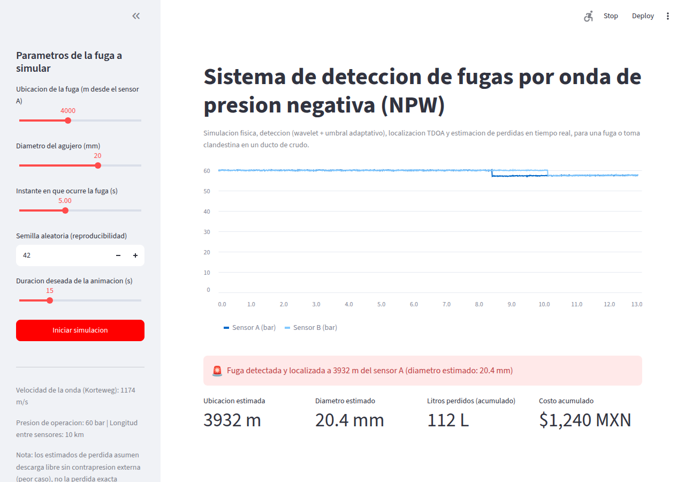
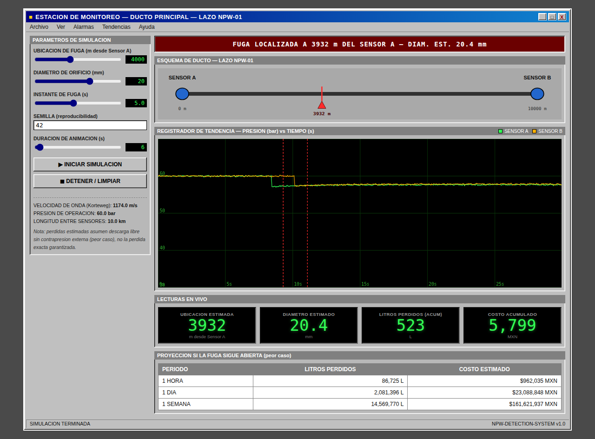

# NPW Pipeline Leak Detection System

Physics-based leak/theft detection, localization and sizing for a liquid
pipeline, using two pressure sensors and a **negative pressure wave (NPW)**
method. Built end-to-end — simulation, signal processing, localization,
and two different live dashboards — as a hands-on portfolio project to
break into industrial automation / instrumentation & controls.

> **Status:** Phases 1–3 and 5 complete and validated. See [Roadmap](#roadmap).

## What it does

When a pipeline develops a leak (mechanical failure, corrosion, or an
illegal tap), the sudden pressure drop travels along the pipe as a wave in
both directions, at a speed set by the fluid and pipe's own elastic
properties. Two pressure transmitters — one at each end of a pipeline
segment — see that wave arrive at slightly different times. From that time
difference alone, the system:

1. **Detects** that an event happened (wavelet-denoised signal + adaptive
   threshold on the derivative — no manual tuning per pipeline).
2. **Localizes** the leak by triangulating with the arrival-time
   difference (TDOA) and the wave speed (Korteweg equation, corrected for
   the fluid *and* the steel pipe's elasticity).
3. **Sizes** the leak (estimates the equivalent orifice diameter) by
   inverting the Joukowsky water-hammer relation and the orifice equation
   from the measured wave amplitude.
4. **Quantifies the loss** in real time — liters and pesos, with a 1
   hour / 1 day / 1 week projection if the leak stays open.

Everything is validated against the simulator's own ground truth (which
the detection algorithm never sees), with the achieved accuracy and known
limitations documented honestly below rather than hidden.

## Demo

Two independent dashboards run on top of the same simulation/detection/
localization engine — built as two different exercises in how the same
data can be presented, from a quick analytics tool to something closer to
a real control-room screen.

### Streamlit dashboard



### Industrial HMI (Flask + plain HTML/CSS/JS, styled after real SCADA/HMI panels)



Both show the same scenario: a 20 mm leak at 4,000 m from Sensor A,
correctly localized at 3,932 m (1.7% error) with live-accumulating
volume/cost readouts and a worst-case projection table.

## How it works

| Step | Physics / method | Module |
|---|---|---|
| Wave speed | Korteweg equation — accounts for both fluid compressibility and pipe wall elasticity, not just the fluid alone | `simulation/simulate_leak.py` |
| Leak transient | Orifice equation (generalized Torricelli) for outflow, Joukowsky relation for the resulting pressure transient | `simulation/simulate_leak.py` |
| Event detection | Discrete Wavelet Transform (Daubechies-4) denoising + Donoho-Johnstone soft-thresholding, adaptive threshold on the signal derivative | `detection/detect_event.py` |
| Localization | Time Difference of Arrival (TDOA): `x = (L − c·Δt) / 2` | `detection/localize_leak.py` |
| Sizing | Joukowsky + orifice equation, inverted and corrected for distance-based attenuation | `detection/localize_leak.py` |
| Loss estimation | Mass-balance accumulation, referenced against real Pemex Mezcla Mexicana crude price + FX rate | `detection/localize_leak.py` |

A deliberate design decision: if only **one** sensor detects an event, the
system does **not** guess a location — TDOA needs both. It raises a
low-confidence alert asking for confirmation instead of reporting a false
precise number. This mirrors how a real industrial system should behave.

## Repository structure

```
NPW-Detection-System/
├── simulation/
│   └── simulate_leak.py        # Phase 1: physics-based leak simulator
├── detection/
│   ├── detect_event.py         # Phase 2: wavelet-based event detection (batch)
│   ├── live_stream.py          # Streaming-safe wrapper (see write-up below)
│   └── localize_leak.py        # Phase 3: TDOA localization + sizing + economics
├── dashboard/
│   └── app.py                  # Phase 5: Streamlit live dashboard
├── dashboard_hmi/
│   ├── server.py                # Phase 5b: Flask backend
│   ├── templates/index.html
│   └── static/{style.css,script.js}   # Retro industrial SCADA-style frontend
└── docs/
    ├── architecture.md
    └── hallazgo_falso_positivo_dwt.md  # Engineering write-up, see below
```

## Engineering write-up: a real bug, found and fixed

While building the live dashboards, one test case reported a leak 1,598 m
away from its real location — far outside the system's normal ~1–2%
error. The root cause turned out to be interesting enough to document in
detail (**[full write-up, in Spanish](docs/hallazgo_falso_positivo_dwt.md)**):

Re-running the wavelet transform from scratch on a *growing* window of
live data (to simulate real-time arrival) can produce a false transient
right at the edge of the current window — a known boundary artifact of
the DWT reconstruction. It's not a real event: running the exact same
detector with one sample more or fewer made it disappear.

**Verified numerically** — the same window, evaluated at consecutive
lengths, flips detection non-monotonically:

| Window length | Detected? |
|---:|:---:|
| 629 samples (6.28s) | No |
| **630 samples (6.29s)** | **Yes — false positive at t=6.26s** |
| 635 samples (6.34s) | No |

**Fix:** `detection/live_stream.py` adds a 1-second confirmation margin —
a detection isn't trusted until it survives one more second of incoming
data. A real event stays; a boundary artifact vanishes. Result:

| Test case | Location error before | Location error after |
|---|---:|---:|
| 4000 m / 20 mm | 68 m (1.7%) | 68 m (1.7%) — unaffected |
| 7700 m / 7 mm | False "low confidence" alert | Correctly reports no detection |
| 8200 m / 10 mm | 1,598 m (19.5%) | 2 m (0.02%) |

The core Phase 2/3 modules (`detect_event.py`, `localize_leak.py`) were
never touched — they were already correct in batch mode. The bug lived
entirely in how the live dashboards fed data to them, which is why the
fix is isolated to its own module instead.

## Tech stack

Python (NumPy, PyWavelets, dataclasses) for the physics/DSP core · two
frontends built on top of the same engine — Streamlit, and a
Flask + vanilla HTML/CSS/JS "industrial HMI" styled after real SCADA
control-room software · Git/GitHub for version control.

## Getting started

Requires Python 3.10+.

```bash
git clone https://github.com/luisgadoa52/NPW-Detection-System.git
cd NPW-Detection-System
python -m venv venv
source venv/bin/activate    # Windows: venv\Scripts\activate
pip install -r requirements.txt
```

**Streamlit dashboard:**
```bash
cd dashboard
streamlit run app.py
```

**Industrial HMI:**
```bash
cd dashboard_hmi
python server.py
# open http://localhost:5000
```

**Command-line demos** (print physical validation numbers directly):
```bash
python simulation/simulate_leak.py
python detection/detect_event.py
python detection/localize_leak.py
```

## Known limitations (by design, documented honestly)

- **Wave model:** a simplified traveling-wave model, not a full Method of
  Characteristics solver — good enough to demonstrate the detection
  principle, not to size a real pipeline's hydraulic transients.
- **Pump compensation:** modeled as a simple threshold-based factor, not
  a real controller/PID response.
- **Loss estimates are worst-case:** free discharge with no external
  backpressure. Real losses depend on terrain, elevation profile, and
  downstream pressure — this is an upper bound, not a guarantee.
- **Minimum detectable leak size** depends on the adaptive noise
  threshold and the leak's distance from each sensor (attenuation) — very
  small leaks near the midpoint of a long segment may go undetected. This
  is a real, physical sensitivity limit, not a bug (verified against
  batch-mode ground truth).
- **Sensor spacing** in the simulation (10 km) is smaller than typical
  real deployments (often 30–80 km, driven by existing pump-station
  infrastructure) — chosen to keep the demo fast and legible.
- **Economic reference price** (`detection/localize_leak.py`,
  `EconomiaConfig`) is a manually-updated snapshot of the Mezcla Mexicana
  crude price and USD/MXN rate, not a live feed.

## Roadmap

- [x] Phase 1 — Physics-based leak simulator
- [x] Phase 2 — Wavelet-based event detection
- [x] Phase 3 — TDOA localization, sizing, and loss estimation
- [x] Phase 5 — Live Streamlit dashboard
- [x] Phase 5b — Industrial-style HMI (Flask + HTML/CSS/JS)
- [ ] Phase 4 — Event classification (sudden rupture vs. slow leak vs.
      valve-type theft) with scikit-learn
- [ ] Phase 6 — OT/cybersecurity layer (API 1164, IEC 62443, Purdue Model)
- [ ] Phase 7 — Optional physical hardware mock-up (hose + ESP32 + sensors)
- [ ] Phase 8 — Full documentation polish

## Author

**Luis Delgado** — building this project hands-on to move into industrial
automation, control systems, and instrumentation.
[LinkedIn](#) · [GitHub](https://github.com/luisgadoa52)
